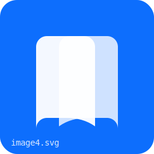
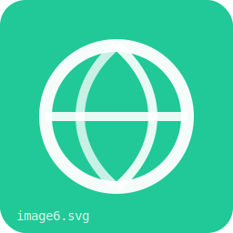

+----------------------------------------------------------------------------------+
| ### Universidad Rafael Landívar                                                  |
|                                                                                  |
| Facultad de Humanidades                                                          |
|                                                                                  |
| Departamento de Educación                                                        |
|                                                                                  |
| **Programa del curso**                                                           |
|                                                                                  |
| +------------------------------------+-----------------------------------------+ |
| | ### Profesorados con Especialidad  | ### Nombre del curso: Introducción al   | |
| | ### en TIC                         | ### Desarrollo Web con Java             | |
| |                                    |                                         | |
| | Año Psicopedagógico                | Número de créditos: 4                   | |
| |                                    |                                         | |
| |                                    | Ciclo y módulo: Cuarto ciclo            | |
| +====================================+=========================================+ |
+----------------------------------------------------------------------------------+

{width="2.3333333333333335in"
height="0.8305555555555556in"}{width="8.268055555555556in"
height="1.5618055555555554in"}

{width="0.5729166666666666in"
height="0.5729166666666666in"}

**1. Información general del curso**

**Carrera:** Profesorado en Tecnología  
**Modalidad:** Híbrida  
**Duración:** 9 semanas  
**Naturaleza del curso:** Teórico–práctico  
**Requisito:** Conocimientos básicos de informática

+-----------------------------------------------------------------------+
| {width="0.4895833333333333in"              |
| height="0.4895833333333333in"}**2. Información general**              |
|                                                                       |
| **2.1 Descripción del curso**                                         |
|                                                                       |
| El curso Introducción al Desarrollo Web con Java está diseñado para   |
| estudiantes del Profesorado en Tecnología, con el propósito de        |
| desarrollar competencias básicas para comprender, facilitar y         |
| acompañar procesos de enseñanza relacionados con el desarrollo de     |
| aplicaciones web.                                                     |
|                                                                       |
| El enfoque del curso no es la formación de programadores              |
| profesionales, sino la preparación de facilitadores tecnológicos,     |
| capaces de entender la lógica del desarrollo web, aplicar buenas      |
| prácticas y guiar proyectos educativos y sociales mediante soluciones |
| tecnológicas sencillas y funcionales.                                 |
|                                                                       |
| A lo largo del curso, los estudiantes desarrollarán una aplicación    |
| web real utilizando Java y Spring Boot, conectada a una base de       |
| datos, orientada a la gestión de información de una entidad sin fines |
| de lucro, priorizando la usabilidad, claridad y facilidad de          |
| mantenimiento.                                                        |
|                                                                       |
| **2.2 Modalidad**                                                     |
|                                                                       |
| El curso se desarrollará en modalidad híbrida, combinando:            |
|                                                                       |
| - **Sesiones presenciales:** orientadas a la explicación conceptual,  |
|   resolución de dudas y acompañamiento práctico.                      |
|                                                                       |
| - **Sesiones sincrónicas:** para demostraciones, retroalimentación y  |
|   seguimiento del proyecto.                                           |
|                                                                       |
| - **Trabajo autónomo:** mediante guías de aprendizaje, ejercicios     |
|   prácticos y avances del proyecto final.                             |
|                                                                       |
| **2.3 Competencias e indicadores de logro**                           |
|                                                                       |
| **Competencia general:**                                              |
| Diseña y facilita soluciones web básicas utilizando Java y Spring     |
| Boot, aplicando principios de programación, control de versiones y    |
| despliegue web, con un enfoque pedagógico y de impacto social.        |
|                                                                       |
| **Indicadores de logro:**                                             |
| - Aplica fundamentos de lógica y buenas prácticas de programación en  |
|   Java.                                                               |
| - Utiliza GitHub para el control de versiones de proyectos            |
|   educativos.                                                         |
| - Comprende patrones de diseño básicos aplicados al desarrollo web.   |
| - Desarrolla una aplicación web sencilla con conexión a base de       |
|   datos.                                                              |
| - Implementa autenticación básica y manejo de roles.                  |
| - Publica y mantiene una aplicación web funcional en internet.        |
| - Presenta un proyecto con impacto social y usabilidad clara.         |
|                                                                       |
| **2.4 Metodología**                                                   |
|                                                                       |
| El curso se desarrollará utilizando las siguientes metodologías:      |
|                                                                       |
| - **Aprendizaje basado en proyectos:** el estudiante construye una    |
|   aplicación web real de manera progresiva.                           |
| - **Aprendizaje guiado:** acompañamiento constante con ejemplos       |
|   prácticos y demostraciones.                                         |
| - **Aprendizaje colaborativo:** revisión entre pares y evaluación     |
|   compartida.                                                         |
| - **Enfoque pedagógico:** reflexión constante sobre cómo enseñar      |
|   estos contenidos en contextos educativos.                           |
|                                                                       |
| **2.5 Proyecto que se desarrollará**                                  |
|                                                                       |
| Los estudiantes desarrollarán una aplicación web funcional orientada  |
| al registro y gestión de información de una entidad sin fines de      |
| lucro, como guarderías, casas hogar o dispensarios comunitarios.      |
|                                                                       |
| El sistema permitirá:                                                 |
| - Registro de información básica                                      |
| - Gestión sencilla de datos                                           |
| - Autenticación por perfiles                                          |
| - Interfaz amigable y accesible                                       |
| - Fácil mantenimiento y escalabilidad básica                          |
|                                                                       |
| **2.6 Responsabilidades del estudiante**                              |
|                                                                       |
| - Participar activamente en sesiones presenciales y sincrónicas.      |
| - Completar las guías de aprendizaje.                                 |
| - Avanzar progresivamente en el proyecto.                             |
| - Aplicar buenas prácticas de organización y documentación.           |
| - Participar en la evaluación de pares.                               |
+=======================================================================+
| {width="0.5833333333333334in"          |
| height="0.5833333333333334in"}                                        |
| **3. Programación del curso**                                         |
+-----------------------------------------------------------------------+

**Semana 1 – Unidad 1**

**Fundamentos de Java y buenas prácticas de lógica**

*Aprendizajes esperados:*
- Comprende la estructura básica del lenguaje Java.
- Aplica indentación y buenas prácticas de lógica.

*Contenidos temáticos:*
- Introducción a Java
- Variables, condicionales y ciclos
- Métodos y organización del código
- Buenas prácticas para principiantes

**Semana 2 – Unidad 2**

**GitHub y control de versiones**

*Aprendizajes esperados:*
- Utiliza GitHub como herramienta de versionamiento.
- Comprende la importancia del control de cambios.

*Contenidos temáticos:*
- Git y GitHub
- Repositorios y commits
- Buenas prácticas de versionamiento educativo

**Semana 3 – Unidad 3**

**Patrones de diseño aplicados a la web**

*Aprendizajes esperados:*
- Comprende patrones de diseño básicos.
- Aplica el patrón MVC de forma conceptual.

*Contenidos temáticos:*
- Introducción a patrones de diseño
- Separación de responsabilidades
- MVC aplicado a aplicaciones web

**Semana 4 – Unidad 4**

**Inicios con Spring Boot y entorno de trabajo**

*Aprendizajes esperados:*
- Prepara el entorno de desarrollo.
- Comprende la estructura de un proyecto Spring Boot.

*Contenidos temáticos:*
- Spring Boot
- Requisitos técnicos
- Creación del primer proyecto web

**Semana 5 – Unidad 5**

**Desarrollo web con Spring Boot I (rutas y controladores)**

*Aprendizajes esperados:*
- Implementa rutas y controladores básicos.
- Diseña formularios sencillos para captura de datos.

*Contenidos temáticos:*
- Rutas y controladores
- Formularios (GET/POST) y validación básica

**Semana 6 – Unidad 6**

**Desarrollo web con Spring Boot II (persistencia y roles)**

*Aprendizajes esperados:*
- Implementa persistencia de datos en una base de datos sencilla.
- Desarrolla una funcionalidad con autenticación/roles básicos.

*Contenidos temáticos:*
- Base de datos sencilla (persistencia)
- Renderizado condicional
- Roles básicos de usuario

**Semana 7 – Unidad 7**

**Despliegue (deploy) de la aplicación web**

*Aprendizajes esperados:*
- Publica la aplicación web en internet.

*Contenidos temáticos:*
- Deploy

**Semana 8 – Unidad 8**

**Seguridad, QA y mantenimiento**

*Aprendizajes esperados:*
- Aplica seguridad básica y buenas prácticas de QA.
- Realiza cambios y redeploy del sistema.

*Contenidos temáticos:*
- Seguridad básica
- QA y mantenimiento
- Redeploy

**Semana 9 – Unidad 9**

**Entrega del proyecto y evaluación de pares**

*Aprendizajes esperados:*
- Presenta un proyecto funcional.
- Evalúa proyectos de forma crítica y constructiva.

*Contenidos temáticos:*
- Presentación del proyecto
- Evaluación de pares
- Retroalimentación y reflexión final
