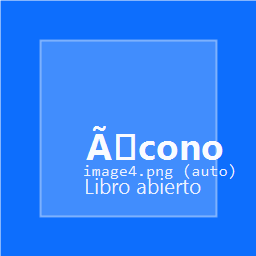
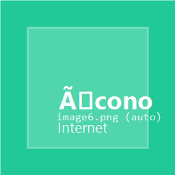
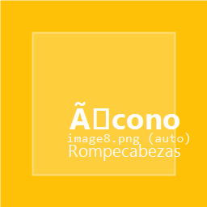

+--------------------------------------------------------------------------+
| ### Universidad Rafael Landivar                                          |
|                                                                          |
| Facultad de Humanidades                                                  |
|                                                                          |
| Departamento de Educacion                                                |
|                                                                          |
| **Guia de aprendizaje num. 5**                                           |
|                                                                          |
| **Semana 5 - Unidad 5**                                                  |
|                                                                          |
| **Fecha de entrega: Viernes 20 de febrero de 2026**                      |
|                                                                          |
| +----------------------------+-----------------------------------------+ |
| | Profesorados con           | Nombre del curso: Introduccion al       | |
| | Especialidad en TIC        | Desarrollo Web con Java                 | |
| |                            |                                         | |
| | **Ano Psicopedagogico**    | Enfoque Pedagogico para Docentes       | |
| +============================+=========================================+ |
+--------------------------------------------------------------------------+

{width="3.2336996937882763in"
height="1.3760411198600175in"}{width="8.268055555555556in"
height="1.5618055555555554in"}

{width="0.5729166666666666in"
height="0.5729166666666666in"}

**PARTE INTRODUCTORIA**

***"Una ruta es una decision didactica: conecta una necesidad del usuario con una accion concreta del sistema."***

**Contexto (conexion con Semana 4):** ya se construyo el inicio del CRUD y se comprendio la estructura MVC. En Semana 5 nos enfocamos en **rutas y controladores**, y en el **por que** de las dependencias e imports para que el estudiante pueda explicar, no solo copiar. El objetivo es que el grupo domine el camino completo: **URL -> Controlador -> Vista -> Guardado**.

+---------------------------------+------------------------------------+
| **Aprendizajes esperados**      | **Productos que evidencian el      |
|                                 | aprendizaje**                      |
+=================================+====================================+
| **Identifica rutas y explica el | *Mapa de rutas MVC:* diagrama simple |
| flujo MVC con sus palabras.**   | con 3 rutas y su proposito.*        |
+---------------------------------+------------------------------------+
| **Crea controladores con GET y  | *Controlador funcional:* evidencia   |
| POST para mostrar y guardar.**  | de GET y POST en funcionamiento.*   |
+---------------------------------+------------------------------------+
| **Conecta formulario con        | *Formulario conectado:* captura del  |
| @ModelAttribute y guarda datos.**| listado con datos creados.*        |
+---------------------------------+------------------------------------+
| **Explica imports y dependencias | *Bitacora tecnica:* lista con 6      |
| esenciales del proyecto.**      | imports/dependencias y su motivo.*  |
+---------------------------------+------------------------------------+

+-----------------------------------------------------------------------+
| {width="0.4895833333333333in"              |
| height="0.4895833333333333in"}**PRIMERA PARTE: REFUERZO MVC Y         |
| DEPENDENCIAS (COMPRENDER ANTES DE CODIFICAR)**                          |
|                                                                       |
| **Proposito de la actividad:** reforzar el mapa mental MVC y el por que |
| de las dependencias del proyecto (que aporta cada una al sistema).      |
|                                                                       |
| **Actividades (Instrucciones):**                                      |
|                                                                       |
| 1) **Lectura guiada (25-35 min)**                                     |
|   - Abrir el material HTML de la semana:                               |
|     - `Material_Sesion_Clase_5_RUTAS/index.html`                        |
|   - Leer la seccion "Dependencias e imports" y responder:              |
|     - Cual dependencia permite trabajar con rutas web.                 |
|     - Cual dependencia permite plantillas (templates) HTML.            |
|     - Cual dependencia permite acceso a BD.                            |
|                                                                       |
| 2) **Mapa MVC + rutas (20-25 min)**                                   |
|   - Crear un diagrama sencillo con 3 rutas:                            |
|     - `/recursos` (listar)                                             |
|     - `/recursos/nuevo` (formulario)                                  |
|     - `/recursos` (POST guardar)                                      |
|   - Escribir 1 frase por ruta: que hace y que vista usa.               |
|                                                                       |
| **Recursos:** Material HTML Sesion 5 y notas de la Semana 4.           |
|                                                                       |
| **Evaluacion (Formativa):** claridad del mapa y explicacion oral.      |
+=======================================================================+

{width="0.5833333333333334in"
height="0.5833333333333334in"}

**SEGUNDA PARTE: CONSTRUCCION DE RUTAS Y CONTROLADORES (PASO A PASO)**

**Proposito de la actividad:** construir rutas coherentes y controladores claros para mostrar vistas y guardar datos. La meta no es solo que funcione, sino poder explicarlo con calma.

**Entregable principal (equipo, 3-4 integrantes): Controlador funcional + formulario conectado**

1) **Checklist previo (equipo):**
- Verificar que el proyecto compila y arranca.
- Confirmar que existe `templates/recursos/` con `lista.html` y `formulario.html`.

2) **Crear Controlador (equipo):**
- Anotaciones minimas: `@Controller` y `@RequestMapping("/recursos")`.
- Inyectar repositorio con constructor.
- Agregar rutas GET:
  - `@GetMapping` para listar.
  - `@GetMapping("/nuevo")` para mostrar formulario.
- Agregar ruta POST:
  - `@PostMapping` para guardar.

3) **Explicacion de cada import (equipo):**
- `org.springframework.stereotype.Controller` = habilita manejo de vistas.
- `org.springframework.ui.Model` = bolsa de datos para la vista.
- `org.springframework.web.bind.annotation.*` = rutas y enlace de datos.
- `org.springframework.beans.factory.annotation.Autowired` o constructor = inyeccion de dependencias.
- `repositorio.RecursoDidacticoRepositorio` = acceso a datos.
- `modelo.RecursoDidactico` = entidad que se guarda.

4) **Conectar formulario (equipo):**
- En `formulario.html`, usar `th:object` y `th:field`.
- En el POST, manejar nulos en booleanos (`disponible`).
- Redirigir a `/recursos` al guardar.

**Evaluacion (rubrica rapida 100 pts):**
- GET lista + vista carga sin error: 25
- GET formulario + campos visibles: 20
- POST guarda y redirige: 25
- Explicacion de imports y dependencias: 20
- Orden y claridad de codigo: 10

{width="0.4895833333333333in"
height="0.4895833333333333in"}

**CRONOGRAMA (10 horas)**

  -----------------------------------------------------------------------
  **Actividad**                             **Tiempo**     **Aprendizaje**
  ----------------------------------------  ------------   ------------------------------
  Lectura guiada + mapa MVC                  2.0 horas     Comprension de rutas
  Explicacion de dependencias e imports      2.0 horas     Fundamentos tecnicos
  Construccion de rutas y controlador        4.0 horas     Flujo MVC funcional
  Formularios y validacion basica            1.5 horas     Guardado correcto
  Bitacora + reflexion docente               0.5 horas     Metacognicion
                                            Total: 10 horas
  -----------------------------------------------------------------------

{width="0.4895833333333333in"
height="0.4895833333333333in"}

**RECURSOS DE APOYO**

- Material HTML Sesion 5: `Material_Sesion_Clase_5_RUTAS/`
- Material Sesion 4 (CRUD inicial): `Material_Sesion_Clase_4_CRUD/`
- Spring Initializr: https://start.spring.io/
- Spring Boot (referencia): https://spring.io/projects/spring-boot
