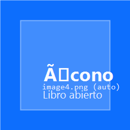

+--------------------------------------------------------------------------+
| ### Universidad Rafael Landivar                                          |
|                                                                          |
| Facultad de Humanidades                                                  |
|                                                                          |
| Departamento de Educacion                                                |
|                                                                          |
| **Guia de aprendizaje num. 8**                                           |
|                                                                          |
| **Semana 8 - Unidad 8**                                                  |
|                                                                          |
| **Fecha de entrega: Viernes 13 de marzo de 2026**                        |
|                                                                          |
| +----------------------------+-----------------------------------------+ |
| | Profesorados con           | Nombre del curso: Introduccion al       | |
| | Especialidad en TIC        | Desarrollo Web con Java                 | |
| |                            |                                         | |
| | **Ano Psicopedagogico**    | Enfoque Pedagogico para Docentes       | |
| +============================+=========================================+ |
+--------------------------------------------------------------------------+

{width="3.2336996937882763in"
height="1.3760411198600175in"}{width="8.268055555555556in"
height="1.5618055555555554in"}

{width="0.5729166666666666in"
height="0.5729166666666666in"}

**PARTE INTRODUCTORIA**

***"La seguridad no es un extra: es la diferencia entre una app que cuida a sus usuarios y una que los expone."***

**Contexto (conexion con Semana 7):** la app ya esta publicada en Render con Docker. En Semana 8 agregamos **seguridad** (autenticacion y roles), **campos inteligentes** (getters calculados y setters con transformacion) y un proceso de **QA manual** antes de cada deploy. El objetivo es que el grupo complete el ciclo: **proteger → calcular → verificar → publicar con confianza**.

+---------------------------------+------------------------------------+
| **Aprendizajes esperados**      | **Productos que evidencian el      |
|                                 | aprendizaje**                      |
+=================================+====================================+
| **Configura Spring Security     | *SecurityConfig funcional:*        |
| con roles y login               | evidencia de login/logout con 2    |
| personalizado.**                | roles (USER, ADMIN).*              |
+---------------------------------+------------------------------------+
| **Implementa getters calculados | *Getter visible en vista:* campo   |
| con @Transient que no se        | calculado (total, edad o estado)   |
| persisten en BD.**              | mostrado en la lista.*             |
+---------------------------------+------------------------------------+
| **Implementa setters con        | *Dato transformado:* evidencia de  |
| transformacion que limpian o    | que el dato se guarda limpio       |
| formatean datos al guardar.**   | (ej: mayusculas, solo digitos).*   |
+---------------------------------+------------------------------------+
| **Aplica QA manual y ejecuta    | *Checklist completado + redeploy   |
| un redeploy seguro en           | exitoso:* app con login funcional  |
| Render.**                       | en la URL publica de Render.*      |
+---------------------------------+------------------------------------+

+-----------------------------------------------------------------------+
| {width="0.4895833333333333in"              |
| height="0.4895833333333333in"}**PRIMERA PARTE: SEGURIDAD Y CAMPOS     |
| CALCULADOS (COMPRENDER ANTES DE CODIFICAR)**                           |
|                                                                       |
| **Proposito de la actividad:** comprender los conceptos de             |
| autenticacion, roles, campos derivados y transformacion de datos       |
| antes de implementarlos.                                               |
|                                                                       |
| **Actividades (Instrucciones):**                                      |
|                                                                       |
| 1) **Lectura guiada — Seguridad (25-35 min)**                         |
|   - Abrir el material HTML de la semana:                               |
|     - `Material_Sesion_Clase_8_SEGURIDAD/index.html`                    |
|   - Leer la seccion "Seguridad basica" y responder:                    |
|     - ¿Que pasa al agregar spring-boot-starter-security sin            |
|       configurar nada?                                                 |
|     - ¿Que es SecurityFilterChain y que hace?                          |
|     - ¿Por que se usa BCrypt para las contrasenas?                     |
|     - ¿Que diferencia hay entre permitAll() y authenticated()?         |
|                                                                       |
| 2) **Lectura guiada — Campos calculados (20-25 min)**                 |
|   - Leer la seccion "Getters y Setters calculados" y responder:        |
|     - ¿Que hace @Transient?                                           |
|     - ¿Por que no guardar un total en la BD?                           |
|     - ¿Que transformaciones se pueden hacer en un setter?              |
|   - Crear una tabla con 2 columnas: getter calculado que van a         |
|     implementar y setter con transformacion que van a implementar.     |
|                                                                       |
| 3) **Mapa conceptual de seguridad (15-20 min)**                       |
|   - Dibujar el flujo de autenticacion:                                 |
|     - URL → ¿ruta protegida? → ¿autenticado? → ¿tiene rol? → acceso  |
|   - Identificar que rutas seran publicas y cuales protegidas           |
|     en su proyecto.                                                    |
|                                                                       |
| **Recursos:** Material HTML Sesion 8 y notas de la Semana 7.           |
|                                                                       |
| **Evaluacion (Formativa):** claridad de respuestas y mapa, tabla       |
| de campos planificados.                                                |
+=======================================================================+

{width="0.5833333333333334in"
height="0.5833333333333334in"}

**SEGUNDA PARTE: IMPLEMENTACION DE SEGURIDAD, CAMPOS Y REDEPLOY (PASO A PASO)**

**Proposito de la actividad:** implementar seguridad real, campos inteligentes y un redeploy seguro. La meta no es solo que funcione, sino poder explicar cada decision.

**Entregable principal (equipo, 3-4 integrantes): App con seguridad + campos calculados + redeploy verificado**

1) **Checklist previo (equipo):**
- Verificar que la app funciona en localhost.
- Verificar que la URL de Render sigue activa.
- Tener Git configurado y poder hacer push.

2) **Implementar Spring Security (equipo):**
- Agregar dependencia `spring-boot-starter-security` al pom.xml.
- Crear carpeta `config/` y archivo `SecurityConfig.java`.
- Definir al menos 2 roles: USER y ADMIN.
- Crear `templates/login.html` con formulario Thymeleaf.
- Agregar `@GetMapping("/login")` al controlador.
- Agregar boton de logout en las vistas protegidas.
- Verificar: login correcto, login incorrecto, logout, roles.

3) **Implementar campos calculados (equipo):**
- Elegir al menos 1 getter calculado:
  - `getTotal()` = precio × cantidad (con `@Transient`)
  - `getEdad()` = Period.between(fechaNac, now) (con `@Transient`)
  - `getEstado()` = logica basada en cantidad/activo (con `@Transient`)
- Elegir al menos 1 setter con transformacion:
  - `setNombre()` → trim() + toUpperCase()
  - `setEmail()` → trim() + toLowerCase()
  - `setTelefono()` → replaceAll("[^0-9]", "")
- Verificar en la vista y crear un registro de prueba.

4) **QA manual (equipo):**
- Completar el checklist de 8 puntos en localhost:
  - App arranca, login correcto/incorrecto, crear registro,
    listar, campo calculado, roles, logout, responsive.
- Solo si todo pasa: continuar al deploy.

5) **Redeploy seguro (equipo):**
- git add . + commit descriptivo + push.
- Verificar build en Render.
- Probar login en la URL publica.
- Probar desde el celular.

6) **Explicacion del proceso (equipo):**
- Escribir 8-12 lineas explicando:
  - ¿Que es Spring Security y que protege?
  - ¿Que es un getter @Transient y por que no se guarda en BD?
  - ¿Que hace un setter con transformacion?
  - ¿Por que es importante el QA manual?

**Evaluacion (rubrica rapida 100 pts):**
- SecurityConfig funcional con 2 roles: 20
- Login/logout funcionales: 15
- Getter calculado visible en vista: 15
- Setter con transformacion verificado: 15
- QA manual completado (checklist): 10
- Redeploy exitoso en Render: 15
- Explicacion clara del proceso: 10

{width="0.4895833333333333in"
height="0.4895833333333333in"}

**CRONOGRAMA (10 horas)**

  -----------------------------------------------------------------------
  **Actividad**                             **Tiempo**     **Aprendizaje**
  ----------------------------------------  ------------   ------------------------------
  Lectura guiada de seguridad               2.0 horas     Comprension de Spring Security
  Lectura y planificacion de campos         1.5 horas     Diseno de getters/setters
  Impl. SecurityConfig + login/logout       3.0 horas     Seguridad funcional
  Impl. getter calculado + setter transf.   2.0 horas     Campos inteligentes
  QA manual + redeploy + explicacion        1.5 horas     Proceso completo
                                            Total: 10 horas
  -----------------------------------------------------------------------

{width="0.4895833333333333in"
height="0.4895833333333333in"}

**RECURSOS DE APOYO**

- Material HTML Sesion 8: `Material_Sesion_Clase_8_SEGURIDAD/`
- Material Sesion 7 (Deploy): `Material_Sesion_Clase_7_DEPLOY/`
- Spring Security (referencia): https://spring.io/projects/spring-security
- Spring Boot (referencia): https://spring.io/projects/spring-boot
- Render Documentation: https://render.com/docs
