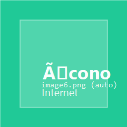

+--------------------------------------------------------------------------+
| ### Universidad Rafael Landivar                                          |
|                                                                          |
| Facultad de Humanidades                                                  |
|                                                                          |
| Departamento de Educacion                                                |
|                                                                          |
| +----------------------------+-----------------------------------------+ |
| | Profesorados con           | Nombre del curso: Introduccion al       | |
| | Especialidad en TIC        | Desarrollo Web con Java                 | |
| |                            | Numero de creditos: 4                   | |
| |                            |                                         | |
| |                            | Ciclo y modulo: Cuarto ciclo            | |
| +============================+=========================================+ |
+--------------------------------------------------------------------------+

{width="3.2336996937882763in"
height="1.3760411198600175in"}{width="8.268055555555556in"
height="1.5618055555555554in"}

**Secuencia de aprendizaje**

Sesion presencial/**[sincronica]{.underline}** #8

**Tema:** Seguridad basica con Spring Security, getters/setters calculados, QA manual y redeploy seguro

**Enfoque del curso (perfil del estudiante):** formacion de docentes TIC. Priorizamos comprension, capacidad de ensenar y evidencias por proceso.

+----------------+------------------------------------------------------------+
|                | {width="0.4583333333333333in" |
|                | height="0.4583333333333333in"}**Informacion importante**  |
+================+============================================================+
| **Aprendizajes | - Configura Spring Security con roles y autenticacion      |
| esperados**    |   basica para proteger rutas de la aplicacion.             |
|                |                                                            |
|                | - Implementa getters calculados con @Transient y           |
|                |   setters con transformacion para campos derivados.        |
|                |                                                            |
|                | - Aplica un checklist de QA manual para verificar la       |
|                |   app antes de cada deploy.                                |
|                |                                                            |
|                | - Ejecuta un redeploy seguro en Render y verifica el       |
|                |   funcionamiento en la URL publica.                        |
+----------------+------------------------------------------------------------+
| **Contenidos   | - Spring Security: dependencia, SecurityConfig,             |
| tematicos**    |   SecurityFilterChain, roles, BCrypt.                      |
|                |                                                            |
|                | - Login/logout personalizado con Thymeleaf.                |
|                |                                                            |
|                | - @Transient: getters calculados (total, edad, estado).    |
|                |                                                            |
|                | - Setters con transformacion (trim, uppercase, regex).     |
|                |                                                            |
|                | - QA manual: checklist de 8 puntos.                        |
|                |                                                            |
|                | - Redeploy seguro: ciclo commit-push-verificar.            |
+----------------+------------------------------------------------------------+
| **Habilidades  | - Configurar seguridad basica sin copiar codigo a ciegas.  |
| y destrezas**  |                                                            |
|                | - Disenar campos calculados que eviten datos redundantes.  |
|                |                                                            |
|                | - Verificar sistematicamente la app antes de publicar.     |
+----------------+------------------------------------------------------------+
| **Valores y    | - Responsabilidad al proteger datos de usuarios.           |
| actitudes**    |                                                            |
|                | - Disciplina en el proceso de verificacion y deploy.       |
+----------------+------------------------------------------------------------+
| **Productos    | *SecurityConfig funcional + login/logout + getter           |
| que evidencian | calculado + setter con transformacion + QA completado +    |
| el             | redeploy verificado + explicacion del proceso (8-12        |
| aprendizaje**  | lineas).*                                                  |
+----------------+------------------------------------------------------------+

  -----------------------------------------------------------------------
  {width="0.5104166666666666in"
  height="0.5104166666666666in"}**Desarrollo de la secuencia**
  -----------------------------------------------------------------------

  -----------------------------------------------------------------------

1.  **Activacion de presaberes**

*Actividad: "¿Quien puede entrar a tu app?" (lluvia de ideas rapida).*

*Tiempo estimado: 10 minutos*

*Recursos: Pizarra o diapositiva con URL publica de una app sin seguridad.*

*Actividad que realizara el estudiante: responder que pasaria si alguien desconocido abre la URL de su app y empieza a crear o borrar registros. Discutir por que se necesita un "portero" (autenticacion).*

2.  **Retroalimentacion**

*Actividad: repaso del deploy exitoso de Semana 7 (10 min).*

*Tiempo estimado: 10 minutos*

*Recursos: Material HTML Sesion 7 (`Material_Sesion_Clase_7_DEPLOY/index.html`).*

*Actividad que realizara el estudiante: verificar que su app sigue activa en la URL de Render. Identificar que archivos tienen en su proyecto (Dockerfile, application.properties) y explicar brevemente que hace cada uno.*

3.  **Construccion del conocimiento (hands-on)**

***Actividad 1: Agregar Spring Security (30 min)***

*Tiempo estimado: 30 minutos*

*Recursos: seccion "Seguridad basica" del material HTML (`Material_Sesion_Clase_8_SEGURIDAD/index.html`).*

*Actividad que realizara el estudiante: agregar la dependencia spring-boot-starter-security al pom.xml, observar que toda la app se bloquea con un login automatico. Luego crear SecurityConfig.java con 2 roles (USER y ADMIN), crear login.html con formulario Thymeleaf, y verificar que el login correcto e incorrecto funcionan.*

*Evaluacion: el login funciona con ambos roles y el logout redirige correctamente.*

***Actividad 2: Getters calculados y setters con transformacion (25 min)***

*Tiempo estimado: 25 minutos*

*Recursos: seccion "Getters y Setters calculados" del material HTML.*

*Actividad que realizara el estudiante: elegir e implementar al menos 1 getter calculado con @Transient (ej: getTotal, getEdad, getEstado) y al menos 1 setter con transformacion (ej: setNombre con trim/toUpperCase, setTelefono con replaceAll). Verificar que el getter aparece correctamente en la vista y que el setter transforma el dato al guardar.*

*Evaluacion: campo calculado visible en la lista + dato transformado en la BD.*

***Actividad 3: QA manual con checklist (15 min)***

*Tiempo estimado: 15 minutos*

*Recursos: checklist de QA de 8 puntos del material HTML.*

*Actividad que realizara el estudiante: verificar sistematicamente cada punto del checklist en localhost (app arranca, login correcto/incorrecto, crear registro, campo calculado, roles, logout, responsive). Marcar cada punto como verificado antes de hacer push.*

*Evaluacion: checklist completo y sin items pendientes.*

***Actividad 4: Redeploy seguro (25 min)***

*Tiempo estimado: 25 minutos*

*Recursos: seccion "Redeploy" del material HTML + cuenta de Render.*

*Actividad que realizara el estudiante: hacer git add, commit con mensaje descriptivo, y push. Verificar en Render que el build arranca. Esperar a que termine y probar el login en la URL publica. Si el build falla, leer los logs y corregir.*

4.  **Aplicacion del conocimiento**

***Actividad 1: Contenido condicional con sec:authorize (15 min)***

*Tiempo estimado: 15 minutos*

*Recursos: seccion de sec:authorize del material HTML.*

*Actividad que realizara el estudiante: agregar thymeleaf-extras-springsecurity6 y usar sec:authorize para mostrar "Bienvenido, [nombre]" solo si esta autenticado, y un boton de admin solo para ADMIN. Hacer un segundo push y verificar en Render.*

*Evaluacion: contenido condicional visible segun el rol.*

5.  **Reflexion sobre mi proceso de aprendizaje**

*Actividad: "Como le explicaria la seguridad web a un alumno de secundaria".*

*Tiempo estimado: 10 minutos*

*Actividad que realizara el estudiante: redactar 1 analogia para explicar autenticacion y 1 analogia para explicar un getter calculado, sin usar palabras tecnicas.*

6.  **Introduccion al siguiente tema**

*Actividad: adelanto Semana 9 (presentacion final).*

*Tiempo estimado: 5 minutos*

*Actividad que realizara el estudiante: anotar que funcionalidades quiere pulir para la demo final (5-8 min por equipo). La Semana 9 cada equipo presentara su app completa funcionando en Render.*

7.  **Actividad de cierre y despedida**

*Actividad: ticket de salida.*

*Tiempo estimado: 5 minutos*

*Actividad que realizara el estudiante: completar la frase "La seguridad en una app es como ______ porque ______" y compartir el getter calculado que implementaron y por que decidieron no guardarlo en la BD.*
